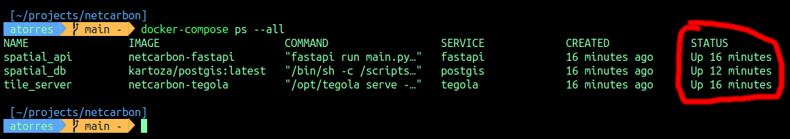

# Description

Demonstration of a basic system for collecting, storing, processing and providing access to spectral indices data and derived products.

The system is composed by:

- An ETL tool
- Data storage solution
- Data processing solution
- A standard Web API
- A vector tile Web service

## Requirements

1. A recent version of MacOS or Linux with at least 16GB RAM and some free space on disk. It may also work on Windows, but I haven't tested it in that environment.
1. A [git](https://www.git-scm.com/downloads) client
1. [Docker](https://docs.docker.com/engine/install/)

## Installation steps

1. Get a local copy of the project

```bash
# Create a root folder for the project, for example
mkdir -p ~/projects/
cd ~/projects/

# Clone the project
git clone https://github.com/artorresv/netcarbon.git
```

2. Build and run Docker services

```bash
    cd ~/projects/netcarbon

    # Both commands may take several minutes
    docker-compose build --no-cache
    docker-compose up -d
```

If everything went well, the result of the last command should be something like this:


To confirm that all containers are working as expected, run: `docker-compose ps --all`



[!NOTE]

- To stop all containers without removing them use: `docker-compose stop`

- To stop **and remove** all containers use: `docker-compose down`

- To stop, remove and build from scratch all the containers use: `docker-compose down && docker-compose build --no-cache && docker-compose up -d`

- If some container is not in an "Up ..." state, check container's logs with `docker-compose logs -f <SERVICE_NAME>`, for example `docker-compose logs -f tegola`:


Press `ctrl + c` to exit the last command.

At this point you should have:

- A PostgreSql instance running on `localhost:45432`:
  - See the user name and password [here](docker-compose.yml).

  - This instance has a database called **gis** with the **postgis** and **postgis_raster** extensions enabled, 3 empty tables, 1 materialize view and 3 custom functions. See details [here](postgresql/migrations/db_schema.sql).

  - The basic data model is composed of 3 tables: `plots` for the parcel's geometry and ID, `products` for the time series of spectral indices, which directly stores each spectral index in a postgis raster column along with the date and plot identifier. Table `regions` is intended to store subnational administrative regions but is not currently used.

    

  - You can use any postgres client to get interactive access to this instance.

    

- A [FastAPI](https://fastapi.tiangolo.com/) instance running on [http://localhost:8123/docs](http://localhost:8123/docs).

  - Check the code here: `fastapi/app/api`.
  
  - As you can see [here](fastapi/app/api/.env), this API is connected to our database running on `localhost:45432`.

- An ETL module:

  - The main purpose is to search for Sentinel 2 images, processing it to obtain spectral indices and storing all related data in the database.

  - This module is part of the Web API, so it can be use as an interactive ETL tool, for example to process a single CSV file with plot data, but also as an API endpoint.

  - Check the code here: `fastapi/app/api/etl`.

  - To run this module, you first need to log into the fastapi container and then use the module from there.

- A [Tegola](https://tegola.io/) instance running on [http://localhost:8086/](http://localhost:8086/).

  - Tegola is a vector tile server, with automatic content caching. [Vector tiles](https://en.wikipedia.org/wiki/Vector_tiles) are a de facto standard for publishing GIS data as web map layers.

  - As you can see [here](tegola/config.toml), the server is connected to our database running on `localhost:45432`.

After installation, the database is empty, so all system components works but data doesn't exists yet.

## System usage

### Data preparation

From the project directory, log into the FastAPI container and run the ETL tool to load data into the database:

```bash
    cd ~/projects/netcarbon

    # log into fastapi contaier
    docker-compose exec fastapi bash

    # If all goes well you are now in a terminal session inside the fastapi container.

    # By default you are in the /app directory
    pwd

    /app

    # Sample data is available in /home/sample_data/:
    ls -l /home/sample_data/

    -rw-rw-r-- 1 1000 1000 46089 Jun 12 22:26 maize.csv
    -rw-rw-r-- 1 1000 1000  2467 Jun 12 22:26 sample.csv
    drwxrwxr-x 2 1000 1000  4096 Jun 13 02:09 screenshots
    -rw-rw-r-- 1 1000 1000 61680 Jun 12 22:26 tournesol.csv

    # Run the ETL tool to generate an NDVI and NDMI time serie for any time window
    time python -m etl.load --start-date 2023-09-01 --end-date 2023-10-01 --input-file /home/sample_data/maize.csv

    time python -m etl.load --start-date 2023-09-01 --end-date 2023-10-01 --input-file /home/sample_data/tournesol.csv

    # As you can see this command may take several minutes to finish, in my case an average of 8 minutes per file with 50 records, for a 3 month time series

    # Exit the container, this will leave you in the terminal session of the host machine
    exit
```

### Data access

There are two ways to explore the generated data, directly from the database and through the API.

#### Database access

From the project directory, log into the postgis container and open an interactive session in the database:

```bash
    cd ~/projects/netcarbon

    # log into fastapi contaier
    docker-compose exec postgis bash

    # If all goes well you are now in a terminal session inside the postgis container.
```


```bash
    # Change to the postgres user
    su postgres

    # Connect to the database
    psql -d gis -U postgres

    # Now you are in the PostgreSQL shell
```


From here, you can verify that the database now has some data, if you followed the examples in the **Data Preparation** section.

```bash
    # In my case, plots table has 50 records
    SELECT count(*) FROM plots;

    # With two columns, an identifier and the geometry
    
    SELECT id, ST_SRID(geom), ST_GeometryType(geom) FROM plots LIMIT 5;
        id    | st_srid | st_geometrytype 
    ---------+---------+-----------------
    8119774 |    2154 | ST_MultiPolygon
    5321690 |    2154 | ST_MultiPolygon
    6429688 |    2154 | ST_MultiPolygon
    2164621 |    2154 | ST_MultiPolygon
    1423296 |    2154 | ST_MultiPolygon
    (5 rows)

    # Products table with the time series has between 6 and 12 observations per plot during Sept. 2023

    SELECT plot_id, product_name, count(*) AS items
    FROM products
    GROUP BY 1, 2
    ORDER BY 3 DESC LIMIT 10;

    plot_id | product_name | items 
    ---------+--------------+-------
    6429688 | ndmi         |    12
    6429688 | ndvi         |    12
    8519989 | ndmi         |    12
    8519989 | ndvi         |    12
    7314865 | ndmi         |    11
    7314865 | ndvi         |    11
    1428287 | ndmi         |    11
    1428287 | ndvi         |    11
    8021282 | ndmi         |    10
    1052375 | ndvi         |    10
    (10 rows)

    # With both NDVI and NDMI indices stored as postgis rasters

    gis=# SELECT plot_id, ST_Summary(rast)
    FROM products
    WHERE plot_id = '1041014' AND
        product_name = 'ndmi' AND
        product_date = '2023-09-27';
    plot_id |                                     st_summary                                     
    ---------+------------------------------------------------------------------------------------
    1041014 | Raster of 34x32 pixels has 1 band and extent of BOX(542325 6303615,542665 6303935)+
            |     band 1 of pixtype 64BF is in-db with NODATA value of -999
    (1 row)

    # There's also an extra table, a materialized view, with the summary statistics of all the indices

    SELECT *
    FROM spectral_indices_stats
    WHERE plot_id = '6429688' AND product_name = 'ndvi';

    plot_id | product_name | product_date | count |        mean        |        stddev        |         min         |        max         
    ---------+--------------+--------------+-------+--------------------+----------------------+---------------------+--------------------
    6429688 | ndvi         | 2023-09-04   | 92666 | 0.8967489210703099 |  0.04135377295656276 |  0.6858044164037854 |  0.987927565392354
    6429688 | ndvi         | 2023-09-07   |   175 | 0.9476374591058725 | 0.028923893995352442 |  0.9169139465875372 | 0.9928411633109621
    6429688 | ndvi         | 2023-09-09   | 10392 | 0.9386139512352859 | 0.039107553547098245 |  0.8332239001969798 | 0.9992166079122602
    6429688 | ndvi         | 2023-09-14   | 18082 | 0.7832126081010781 |  0.11228650605389058 |  0.6102783725910065 | 0.9985283296541576
    6429688 | ndvi         | 2023-09-24   | 15054 | 0.7836731382196777 |  0.09646942721251792 |  0.6014067995310668 | 0.9838220424671383
    6429688 | ndvi         | 2023-09-27   | 20152 | 0.5094537838132673 |  0.17047822238964624 | 0.32867132867132876 |  0.992398327632079
    6429688 | ndvi         | 2023-09-29   | 21090 | 0.4368115501315774 |  0.19152522709845266 |  0.2683846637335009 | 0.9992880028479887
    (7 rows)

    # For now, end the session in the database shell
    exit

    # Leave the postgres user session
    exit

    # And exit the container, this will leave you in the terminal session of the host machine
    exit
```

#### HTTP Access

From any web browser enter this address [http://localhost:8123/docs](http://localhost:8123/docs), if all goes well you can see something like this:


With the first service you can request the time serie of the averages of each spectral index, for all the plots available in the database:


With the second service you can request any spectral index either as grayscale PNG file or as GeoTIFF file:


From the same page you can also copy the request in the [curl](https://curl.se/) format.

Paste the command in a terminal window, but add an extra parameter to save the binary content as a local file:

```shel
curl -X 'GET' \
  'http://localhost:8123/netcarbon/spectral_indices/6429688_20230904_ndvi_3857.tiff' \
  -H 'accept: image/tiff' --output ~/Downloads/6429688_20230904_ndvi_3857.tiff
```


From here you can use gdalinfo to examine the geotiff file:

```shel
gdalinfo ~/Downloads/6429688_20230904_ndvi_3857.tiff
```


### Client applications

The idea in this section was illustrate several ways to show the time series, spectral indices and vector data in web client applications, but I could only prepare a couple of services.

An important data service for most interactive web application design patterns with geospatial data are [vector tile services](https://wiki.openstreetmap.org/wiki/Vector_tiles).

As you can see in this screenshot, using this url template you can access the vector tile service from any client that supports this standard:

http://localhost:8086/maps/plots/{z}/{x}/{y}.pbf


[!NOTE]

As you can see [here](tegola/config.toml), vector tiles in this service were encoded in EPSG:3857, which is the most common projection for web mapping applications.

## Final remarks

- As mentioned before, all installed docker services in this exercise can be removed by calling `docker-compose down`, but it is worth noting that this command doesn't remove the associated docker images. To do this (essentially to save disk space) instead run `docker-compose down --rmi all --remove-orphans`

- Both postgis data and tegola cache [are stored in the host machine (see lines 8 and 46)](docker-compose.yml), so if you turn off all services with `docker-compose down` and then start the services again with `docker-compose up -d`, all the data that have been generated will be accessible without any changes.

- So, if you want to recreate the database from scratch, including the sql schema, you can follow this procedure:

```shell
cd ~/projects/netcarbon

# Turn off all the services
docker-compose down

# Remove postgres data directory
sudo rm -fr postgresql/storage/pgdata/13/

# Remove tegola cached data
sudo rm -fr tegola/storage/cache/plots/

# Start the services
docker-compose build --no-cache && docker-compose up -d
```
